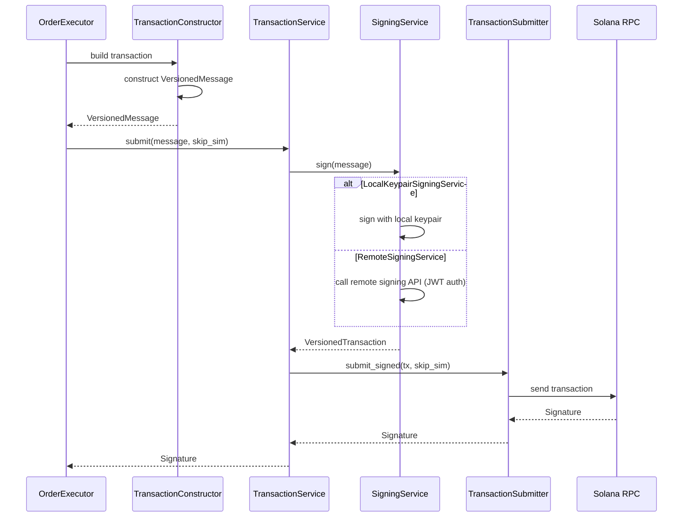
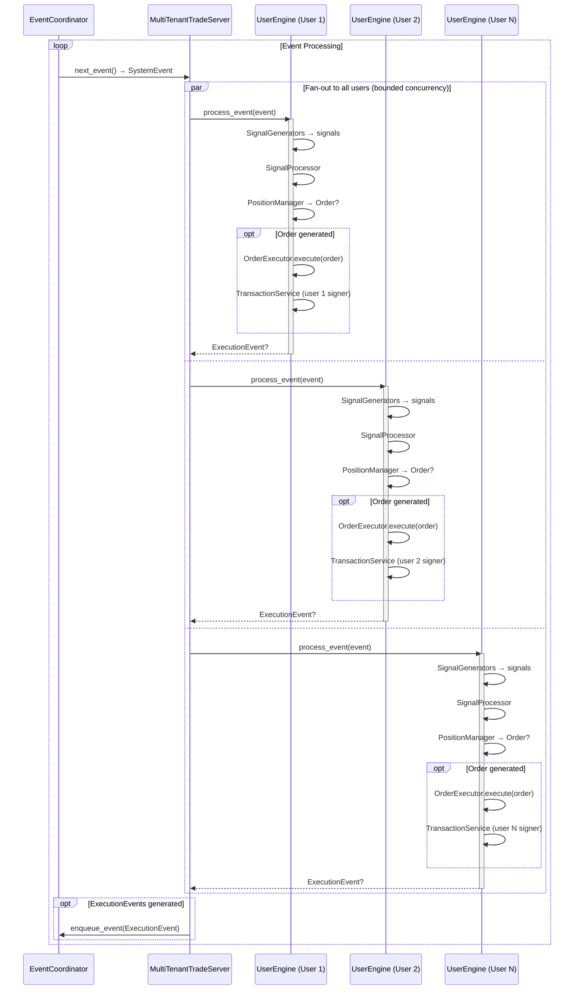

# RFC: Multi-User Support in `trade_server`

## Summary

Add first-class multi-user support to the `trade_server` crate while preserving the existing single-user mode and public surface for downstream bots (e.g., `sniper`). The core ideas are:

- Introduce a signing service abstraction so the engine can use either a local keypair or a remote signing service with JWT-based auth.
- Run multiple, isolated per-user strategy pipelines within a single process (initially), each with its own position state, execution path, and wallet.
- Make event processing “fan-out” to all user strategies, with future support for partitioning users across multiple server instances.
- Encode exit logic with the signal (optional), and keep `PositionManager` as the source of truth for positions without deciding exits on its own.
- Extend persistence, metrics, and API to be user-aware.

See docs/architecture.md for current architecture overview.

## Motivation & Goals

- Support both single-user (today) and multi-user (new) modes with minimal disruption.
- Decouple signing from execution so we can use a GKE signing service in multi-user mode.
- Keep low-latency, high-throughput properties of the engine while isolating users.
- Provide clear scaling path: start single-process multi-tenant, later partition by user id.
- Maintain compatibility for existing bots using `trade_server` as a library (e.g., `sniper`).

Non-goals (initially):
- Building a full user-management system in `trade_server` (we’ll integrate with an external User Service for user lists, configs, and signing).
- On-chain position discovery for arbitrary wallets beyond what we need for reconciliation.

## High-Level Design

### 1) Signing Service Abstraction

Introduce a `SigningService` trait that hides how transactions are signed and how the wallet address is discovered. Two implementations:

- `LocalKeypairSigningService` (single-user mode): wraps an in-process `Keypair` and signs locally.
- `RemoteSigningService` (multi-user mode): holds a JWT and refresh token, decodes wallet address, and signs by calling a remote signing API.

Key responsibilities:
- `wallet_pubkey() -> Pubkey`
- `sign(message: &VersionedMessage) -> Result<VersionedTransaction>`
- Handle token refresh (remote) and expose minimal identity needed for metrics/logging.

This allows `trade_server` to remove the direct dependency on `Keypair` from execution paths.

### 2) Transaction Composition & Submission

Split current submission responsibilities into two layers:

- `TransactionConstructor` (existing): builds `VersionedMessage` and handles DEX-specific details.
- New `TransactionService` (composition): `{ signing: SigningService, submitter: TransactionSubmitter }` offering:
  - `submit(message, skip_simulation) -> Result<Signature>`
  - Internally: `signing.sign(message)` -> `VersionedTransaction` -> `submitter.submit_signed(tx, skip_simulation)`

Refactor `TransactionSubmitter` to accept signed transactions:
- Replace `fn signer_keypair(&self) -> &Keypair` with pure submission API:
  - `submit_signed(tx: &VersionedTransaction, skip_simulation: bool) -> Result<Signature>`
  - `confirm_transaction(signature: Signature) -> Result<()>`

Submitter implementations (RPC, Jito, BloxRoute, ZeroSlot) no longer need direct access to a keypair. They broadcast and confirm only.



### 3) Multi-Tenant Runtime

Introduce a lightweight orchestration layer that manages multiple per-user pipelines inside a single process:

- `UserId` newtype (String/Uuid) to identify users consistently across logs/metrics.
- `UserEngine` struct encapsulating:
  - `Vec<Box<dyn SignalGenerator>>` (user-configurable)
  - `PositionManager` (per-user instance)
  - `TransactionService` (per-user signer + submitter)
  - `ExitStrategy` and `SignalProcessor`
- `MultiTenantTradeServer` that:
  - Fetches next `SystemEvent` from the existing `EventCoordinator`
  - Fans out the event to all `UserEngine`s (in parallel with a concurrency cap)
  - Aggregates back the generated orders/executions into the event stream

Startup flow (multi-user):
- Load user list and per-user strategy configs from an external User Service/DB.
- For each user: create `UserEngine` with their signing service and strategy config.
- Reconcile positions from persisted state + on-chain checks (optional) before processing events.

### 4) Signal/Exit Responsibilities

Refactor signal interfaces to support optional exit plans, keeping backward compatibility:

- Extend `TradableSignal` with an optional `exit_plan() -> Option<ExitPlan>` where `ExitPlan` can include:
  - take-profit threshold
  - stop-loss threshold
  - max holding period
  - wallet-exit policy (e.g., “smart wallet exits”)

`PositionManager` remains the sole source of truth for position state and execution scheduling, but it consults `ExitPlan` when present rather than deciding exit policy itself.

### 5) Persistence, API, and Observability

- Persistence: Use PostgreSQL as the canonical store for positions in multi-user mode. Include `user_id` in all persisted signals, orders, executions, and position events. Maintain compatibility by defaulting to a single implicit user in single-user mode.
- API: extend the JSON-RPC handlers with user-aware endpoints (e.g., `core_getPositions` -> `core_getPositions` with optional `user_id` param; return aggregate if omitted or error if multi-user required). Add a `users_list` method to enumerate active users in the process.
- Observability: Do NOT add `user_id` to metrics to avoid cardinality issues. Include `user_id` in structured logs only. Track aggregate system-level metrics for multi-tenant health.

### 6) Scaling & Partitioning

- Initially: single instance with N `UserEngine`s.
- Later: partition users across multiple instances (e.g., modulo partitioning by `UserId`) while keeping the per-user pipeline unchanged. The event source remains global; partitioning is handled out-of-band by the process placement.

## Detailed Design

### Traits (Rust pseudo-code)

```rust
pub trait SigningService: Send + Sync {
    fn wallet_pubkey(&self) -> solana_sdk::pubkey::Pubkey;
    fn sign(&self, msg: &VersionedMessage) -> anyhow::Result<VersionedTransaction>;
}

pub struct TransactionService {
    signing: Arc<dyn SigningService>,
    submitter: Box<dyn TransactionSubmitter>,
}

impl TransactionService {
    pub async fn submit(
        &self,
        message: &VersionedMessage,
        skip_simulation: bool,
    ) -> anyhow::Result<Signature> {
        let tx = self.signing.sign(message)?;
        self.submitter.submit_signed(&tx, skip_simulation).await
    }
}

#[async_trait]
pub trait TransactionSubmitter: Send + Sync {
    async fn submit_signed(
        &self,
        tx: &VersionedTransaction,
        skip_simulation: bool,
    ) -> Result<Signature>;
    async fn confirm_transaction(&self, signature: Signature) -> Result<()>;
}

pub struct UserEngine {
    user_id: UserId,
    generators: Vec<Box<dyn SignalGenerator>>,
    position_manager: Arc<dyn PositionManager>,
    transaction_service: Arc<TransactionService>,
    signal_processor: SignalProcessor,
}
```

`SolanaOrderExecutor` internally calls `TransactionConstructor` to build a `VersionedMessage` and then delegates to `TransactionService` for signing + submission, removing any direct `Keypair` dependency.

### Event Flow (Multi-User)

- EventCoordinator -> `SystemEvent`
- MultiTenantTradeServer:
  - For each `UserEngine`: `generators -> signals -> SignalProcessor -> PositionHandler -> OrderExecutor`
  - Orders use the user's `TransactionService`
  - Execution events are enqueued back as `SystemEvent::Execution`

Parallelism: fan-out over users with a bounded task semaphore; ensure per-user serialization where necessary (e.g., one position per mint per user).



### Position Reconciliation & Initialization

- On startup, for each user:
  - Load persisted open positions for that user from PostgreSQL DB.
  - Optional on-chain reconciliation: query recent transactions or token accounts to validate tracked positions; add or remove "orphaned" positions via `PositionManager` APIs.
  - Initialize aggregate position metrics at system level.

### API Changes

- Extend `CoreApiHandler` to accept an optional `user_id` parameter:
  - `core_getBalance(user_id?)`, `core_getPositions(user_id?)`, `core_getStats(user_id?)`
  - Without `user_id` in single-user mode: current behavior.
  - Without `user_id` in multi-user mode: return aggregate or error (configurable).
- Add `users_list` endpoint to enumerate active users managed by the process.

### Configuration

- New top-level `mode: single | multi` (default: `single`).
- Multi-user-specific settings:
  - `user_source: { kind: "db" | "static", … }`
  - `signing: { kind: "local" | "remote", … }` (per-user in multi mode)
  - `persistence: { backend: "postgres", connection_string: "…" }`
  - Partitioning hint: `{ shard_count: u32, shard_index: u32 }` for future process-level sharding.

### Backward Compatibility

- Single-user mode uses `LocalKeypairSigningService` and the existing builder defaults; the `sniper` bot requires no code changes if it uses the high-level builder.
- The old `TransactionSubmitter` API remains available behind a deprecated feature flag for one release; new code should migrate to `submit_signed`.

### Security Considerations

- Remote Signing:
  - JWT and refresh tokens are held in memory only; rotate regularly.
  - Restrict remote signing endpoints to necessary scopes (message signing only).
  - Log wallet pubkeys and request ids, never token contents or raw messages unless explicitly allowed.
- Rate limiting and backoff to protect the signing service.

### Observability

- Metrics: Do NOT include `user_id` labels to avoid cardinality issues in large multi-tenant deployments. Keep metrics at system/process level.
- Logging: Include `user_id` in structured logs for:
  - signals processed, orders executed, PnL stats, confirmation latencies
  - signing availability and failures
  - fan-out timing and queue depth in `MultiTenantTradeServer`
- Add aggregate metrics for multi-tenant health (total users, active users, etc.)

## Migration Plan

1) Introduce `SigningService` + `TransactionService` (no behavior change in single-user mode).
2) Update submitters to `submit_signed`; add adapter so old `SolanaTransactionSubmitter` still works during transition.
3) Refactor `SolanaOrderExecutor` to depend on `TransactionService`.
4) Add `UserEngine` and `MultiTenantTradeServer`; gate behind `mode=multi`.
5) Add user-aware API queries; default to current behavior in single-user mode.
6) Integrate remote signing service and user provisioning for multi-user deployments.

## Execution

### Milestone 1: Signing & Transaction Abstraction
**Goal**: All existing tests pass with new signing abstractions in place.

Implement `SigningService` trait with local keypair implementation, introduce `TransactionService` for composition, and refactor submitters to accept signed transactions. Single-user mode continues to work unchanged.

### Milestone 2: Multi-tenant Core
**Goal**: Can run 2+ users in single process, both users can execute trades in isolation.

Implement `UserEngine` and `MultiTenantTradeServer` with event fan-out, per-user position managers, and concurrent execution. Demonstrate two users trading independently within one server instance.

### Milestone 3: User-aware Persistence & API
**Goal**: API returns per-user positions queried from PostgreSQL.

Extend persistence layer to store user-scoped data in PostgreSQL, implement user-aware API endpoints, and verify queries return correct per-user positions and stats.

### Milestone 4: Remote Signing Integration
**Goal**: Multi-user mode executes trades using remote signing service.

Implement `RemoteSigningService` with JWT authentication, integrate with existing signing infrastructure, and verify transactions are successfully signed remotely and submitted.

### Milestone 5: Production Deployment
**Goal**: A test user running a simple strategy in production environment.

Deploy multi-user mode to production, run a test user with a simple strategy (e.g., basic signal generator with minimal risk), monitor metrics and logs, and verify end-to-end functionality in live environment.

## Appendix A: Signal Exit Plan (Sketch)

```rust
pub struct ExitPlan {
    pub take_profit_pct: Option<f64>,   // e.g., 0.15 for +15%
    pub stop_loss_pct: Option<f64>,     // e.g., 0.05 for -5%
    pub max_holding: Option<Duration>,  // absolute cap
    pub wallet_exit_policy: Option<WalletExitPolicy>,
}

pub enum WalletExitPolicy {
    SmartWalletExits,
}

pub trait TradableSignalExt: TradableSignal {
    fn exit_plan(&self) -> Option<&ExitPlan> { None }
}
```

`PositionManager` consults `ExitPlan` when present; otherwise uses configured `ExitStrategy`.

## Appendix B: Sequence (Per-User Order)

1. Event arrives -> fanned to `UserEngine`
2. Generators -> signals -> `SignalProcessor`
3. `PositionHandler` -> potential `Order`
4. `TransactionConstructor` builds `VersionedMessage`
5. `TransactionService`: `SigningService.sign` -> `TransactionSubmitter.submit_signed`
6. On confirm -> `ExecutionEvent` -> positions update -> persistence + notifications

