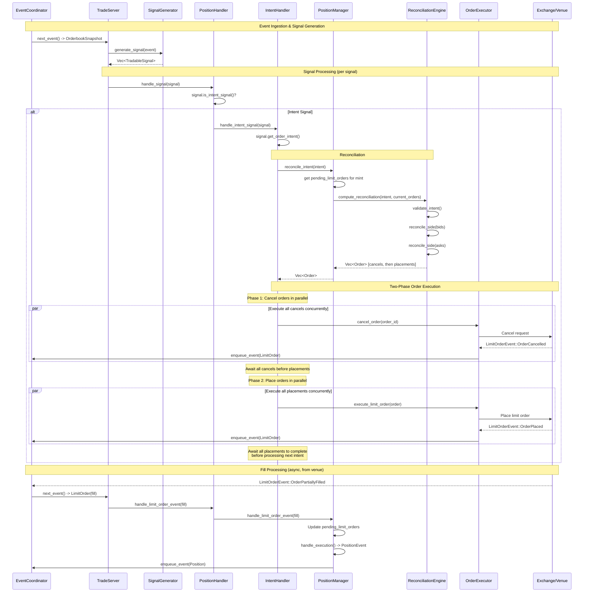
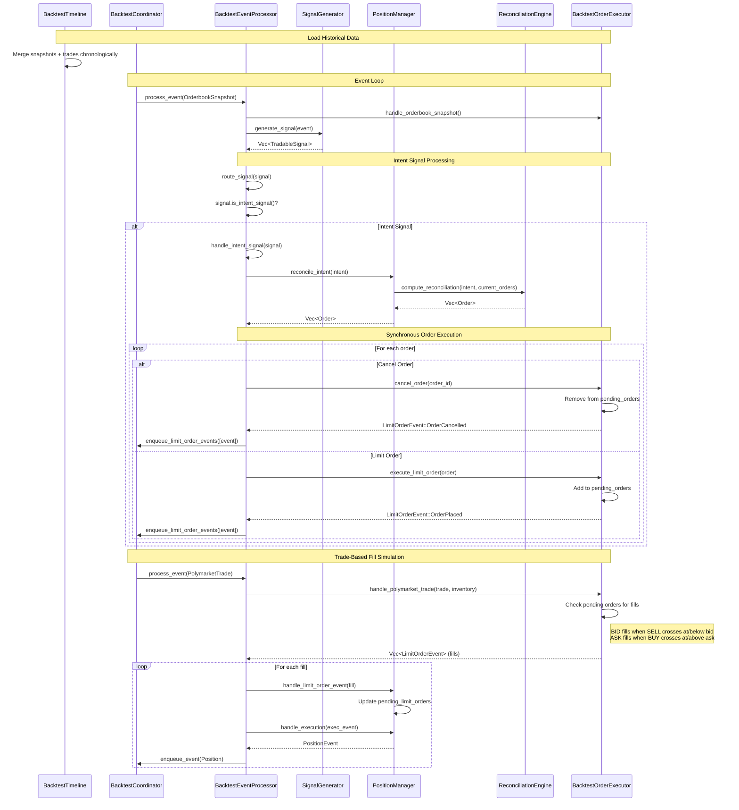

# Signal Processing

This document describes how intent-based signals flow through the system for orderbook trading, covering both realtime and backtest execution modes.

## Overview

The trade server uses an event-driven architecture where:
1. **Events** (orderbook snapshots, trades, timers) flow through the system
2. **SignalGenerators** process events and emit **TradableSignals**
3. **PositionHandler** routes signals to appropriate handlers
4. **IntentHandler** reconciles intent signals against current order state
5. **OrderExecutor** executes the resulting orders

## Intent-Based Signal Flow

Intent signals express **desired orderbook state** rather than discrete actions. The system automatically reconciles current pending orders with the desired state, generating cancel and placement orders as needed.

### Realtime Mode



### Backtest Mode



## Key Components

### Signal Types

| Type | Method | Description |
|------|--------|-------------|
| Intent Signal | `is_intent_signal() = true` | Expresses desired orderbook state via `OrderIntent` |
| Entry Signal | `signal_action() = Entry` | Open a new position |
| Exit Signal | `signal_action() = Exit` | Close an existing position |
| ModifyOrder | `signal_action() = ModifyOrder` | Cancel and replace existing order |
| CancelOrder | `signal_action() = CancelOrder` | Cancel an active order |

### OrderIntent Structure

```rust
OrderIntent {
    signal_id: String,
    mint: String,                      // Asset identifier
    market: Option<String>,            // Market ID for CLOB venues
    bids: Option<Vec<QuoteLevel>>,     // Desired bid levels
    asks: Option<Vec<QuoteLevel>>,     // Desired ask levels
    timestamp: DateTime<Utc>,
}

QuoteLevel {
    price: f64,
    size: f64,
    time_in_force: TimeInForce,
}
```

**Option Semantics:**
- `None` - Preserve existing orders on this side
- `Some([])` - Cancel all orders on this side
- `Some([levels...])` - Reconcile to match these exact levels

### Reconciliation Logic

The `ReconciliationEngine` computes the diff between current and desired state:

```
Current Orders          Desired Levels         Result
─────────────────────────────────────────────────────────
Bid @ 0.45, size 100    Bid @ 0.45, size 100   No change (match)
Bid @ 0.44, size 50     (none)                 Cancel bid @ 0.44
(none)                  Bid @ 0.46, size 75    Place bid @ 0.46
```

Orders are sorted with **cancels before placements** to avoid exceeding position limits.

## Execution Path Comparison

| Aspect | Realtime | Backtest |
|--------|----------|----------|
| Event Source | Redis streams | Parquet files via Timeline |
| Order Execution | Two-phase: cancels then placements (parallel within each phase) | Synchronous in-place |
| Fill Detection | Venue callbacks/WebSocket | Trade-based simulation |
| Limit Orders | Venue API calls | Internal `pending_orders` map |
| Event Coordination | `EventCoordinator` (Redis) | `BacktestEventCoordinator` |

### Backtest Fill Simulation

The `BacktestOrderExecutor` uses trade-based fill logic:
- **BID orders** fill when historical SELL trades cross at or below bid price
- **ASK orders** fill when historical BUY trades cross at or above ask price
- Fills occur at the **order price**, not the trade price
- Partial fills are supported based on trade size
- Optional inventory constraints prevent "naked shorting"

## Position Updates from Fills

When a limit order fills:

1. `LimitOrderEvent::OrderPartiallyFilled` is generated
2. `PositionManager.handle_limit_order_event()` updates `pending_limit_orders`
3. An `ExecutionEvent::OrderFilled` is created with:
   - `token_amount_change`: positive for buys, negative for sells
   - `quote_amount_change`: cash flow from the trade
   - `exit_mode`: propagated from the order (e.g., `StrategyManaged`)
4. `PositionManager.handle_execution()` updates position state
5. `PositionEvent` is emitted for the signal generator to update inventory

## ExitMode Propagation

Orders from intent-based signals use `ExitMode::StrategyManaged`:

```
OrderIntent
    └─> ReconciliationEngine.create_limit_order()
            └─> Order.with_exit_mode(StrategyManaged)
                    └─> LimitOrderEvent.exit_mode
                            └─> ExecutionEvent.exit_mode
                                    └─> Position.exit_mode
```

This ensures positions created from intent-based fills are managed by the strategy, not auto-exited by `ExitStrategy`.

## File Reference

| File | Purpose |
|------|---------|
| `src/signal/sig.rs` | `TradableSignal` trait, `SignalAction` enum |
| `src/signal/intent.rs` | `OrderIntent`, `QuoteLevel` structs |
| `src/trade_server/trade_server.rs` | Main event loop |
| `src/trade_server/position_handler/mod.rs` | Signal routing |
| `src/trade_server/position_handler/intent_handlers.rs` | `IntentHandler` |
| `src/position/reconciliation/engine.rs` | `ReconciliationEngine` |
| `src/position/manager.rs` | `PositionManager` trait |
| `src/execution/executor.rs` | `OrderExecutor` trait |
| `src/execution/backtest/executor.rs` | `BacktestOrderExecutor` |
| `src/backtest/processor.rs` | `BacktestEventProcessor` |

## See Also

- [Intent-Based Position Management](usage-guide/intent-signals.md) - Usage guide for implementing intent signals
- [Orderbook Trading](design/orderbook-trading.md) - Design doc for CLOB support
- [Backtest Infrastructure](design/backtest.md) - Backtest system design
