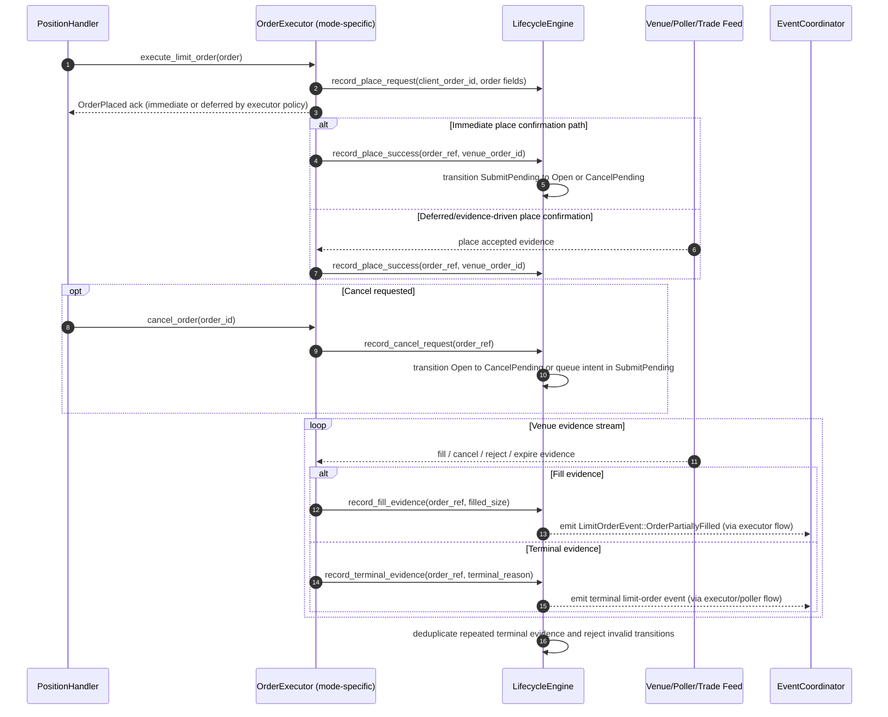

# Execution Module Architecture

## Overview

The `execution` module provides a shared order execution interface (`OrderExecutor`) and venue/mode-specific implementations (`backtest`, `paper`, `polymarket`, `solana`).

For limit orders, lifecycle state is managed by a single canonical state machine in `execution/lifecycle` (`LifecycleEngine`). Executors feed evidence into that engine rather than owning independent lifecycle state transitions.

## Lifecycle Model

Canonical lifecycle states for a logical limit-order intent:

1. `SubmitPending`
2. `Open`
3. `CancelPending`
4. `Terminal(Filled | Cancelled | Rejected | Expired)`

The lifecycle record is keyed internally by `lifecycle_id` and can be resolved by:

- `LifecycleOrderRef::LifecycleId`
- `LifecycleOrderRef::ClientOrderId`
- `LifecycleOrderRef::VenueOrderId`

This allows command-path actions (client ID) and venue evidence (venue ID) to converge on the same canonical record.

## High-Level Sequence

## Mode-Specific Notes

- Backtest and paper executors may defer place/cancel event enqueue when latency simulation is enabled.
- Polymarket defers cancel terminal events until poller/websocket terminal evidence confirms cancellation.
- `LifecycleEngine` remains the single transition authority across these modes.
